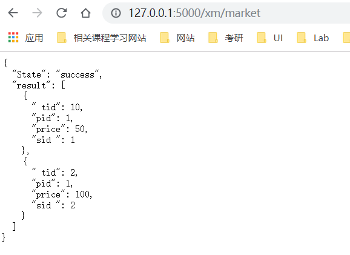

代码框架逻辑：
1. 先建立数据库和表
2. 对表进行操作（写函数），想办法将表加载（采用映射的方法） 
3. 跑通，编写测试文件
4. 内部函数return 0 ，外部函数return json
  
  官方文档: flask-sqlalchemy 
  https://flask-sqlalchemy.palletsprojects.com/en/2.x/
   # ER图和关系模式
   - 说明：宝物的level决定了工作能力和运气值,工作能力决定了赚钱的多少
   - 交易号为sid（避免重复）
   - 宝物没有具体价格，具体价格在交易中由卖家决定。
   1. 开始
  
  
   2. 改动后
   
   
# 设计数据库逻辑
## 玩家框架

## 宝物框架

注意add 只能进行一遍，多来几遍就会报错了

## 游戏界面运行Demo
1. 首页面

2. 登陆

3. 浏览市场

4. 挂牌

5. 购买宝物

6. 定时任务界面
寻宝之前

劳动赚钱和寻宝

寻宝工作多次后player的更新

7. 穿戴宝物

8. 收回挂牌宝物

7. 执行pytest（单元测试）

8.  覆盖率测试结果

9. 报告覆盖率（显示覆盖率报告）

## 知识点
1. 查阅官方文档 sqlalchemy(core) 类似SQL语句的语法，比sqlalchemy(orm)易懂。
2. bug 的生命周期 

3. 如何写测试文件？
手工测试最重要的是了解被测对象。
提BUG句式： “什么东西+ 在什么地方 + 现在有什么问题 + 期望改成什么效果” 
测试用例句式：”什么东西 + 在什么地方 + 期望有什么效果” 
## 调试中出现错误及心得
1.  错误:  重复键违反唯一约束"treasures_pkey"

这个错误我也太...
刚开始通过测试把错误锁定到ForeignKey部分,以为是自己外码部分的语法写的不太多,多次尝试几小时无果,放弃,不然就心梗了.
第二天起来重新弄便数据库才发现可能是init数据库的时候已经插入数据,再来一遍重复插入当然报错.于是删库,再运行发现就可以了..
要么每次初始化之前都记得把之前的先删了比较好不容易起冲突.
2. 模板问题
整了好久,上次做web_1就没弄明白,这次看了好多教程先买呢这个最终可以使用.
https://www.jianshu.com/p/8df0fbe4e64e
默认情况下，Flask在程序文件夹中的templates子文件夹中寻找模板。
在程序文件夹下边新建一个templates文件夹，将模板文件放进去。
3. 看到东西不要先急着上手，把官方tutorial整体看一遍（一定要找靠谱的文档再写），因为关于sqlAchemy的教程有很多，但是是由几种实现方法的，而且它们并不兼容，
像flask-alchemy, sqlalchemy-core, sqlachemy-orm,版本有很多，我刚开始使用的是flask-alchemy,但是因为写到一半发现很多像实现的实现不了，
又改成了sqlalchemy.
import类的时候注意import是不是自己使用的相关的类，用flask-alchemy但是导入了sqlachemy的话是会报错的，而且两者不一样，还是看官方文档，
看一般人写的教程不知道到底用的是哪种把我弄晕了。
查阅官方文档 https://docs.sqlalchemy.org/en/13/
4. 刚开始建表就花了一个晚上，用SQL命令行建的，上机课用命令行键的，于是以为只能用命令行建，思路不清晰，导致试错时间过长。
5. 数据库表名都最好用小写，所有的都用小写，因为用大写最后也是变成了小写，最后分不清大小..
6. 用sqlalchemy 查询出来的东西可能不知道是什么类型就没法利用，这时候print()一下，但是print出来的东西仍然可能不认识，再用type()看一看。
7. 根据开发的原则，后台应该返回json数据用于前台解析。
https://blog.csdn.net/ITBigGod/article/details/83754397
8. debug 小惊喜
上一次作业网页调试实在调试的我崩溃，这次在做定时任务的时候灵光一现，如果定时任务可以直接在命令行调试，错误清楚些，我的其它函数也可以这样。

这样debug快多了而且更直观，不用每次去网页上输测试案例
9. 写代码是个加速度的过程，刚开始很慢，到后面一旦语法框架调试熟练了，就很快了。
10. Test 错误：

插入错误
因为此时返回的不是json字符串， 要使用get_json（）。
详情请看https://blog.csdn.net/orangleliu/article/details/80136615。
11. 

解决返回可能是None的问题要在上面的get_json()里加上force=True.

12.
在代码中开始写try except的时候为了方便调试选择了raise,这样重复插入的时候命令行会提示错误并不解决问题。
解决方法： 设置unique=True,并且看到异常就pass掉或者回滚操作。

